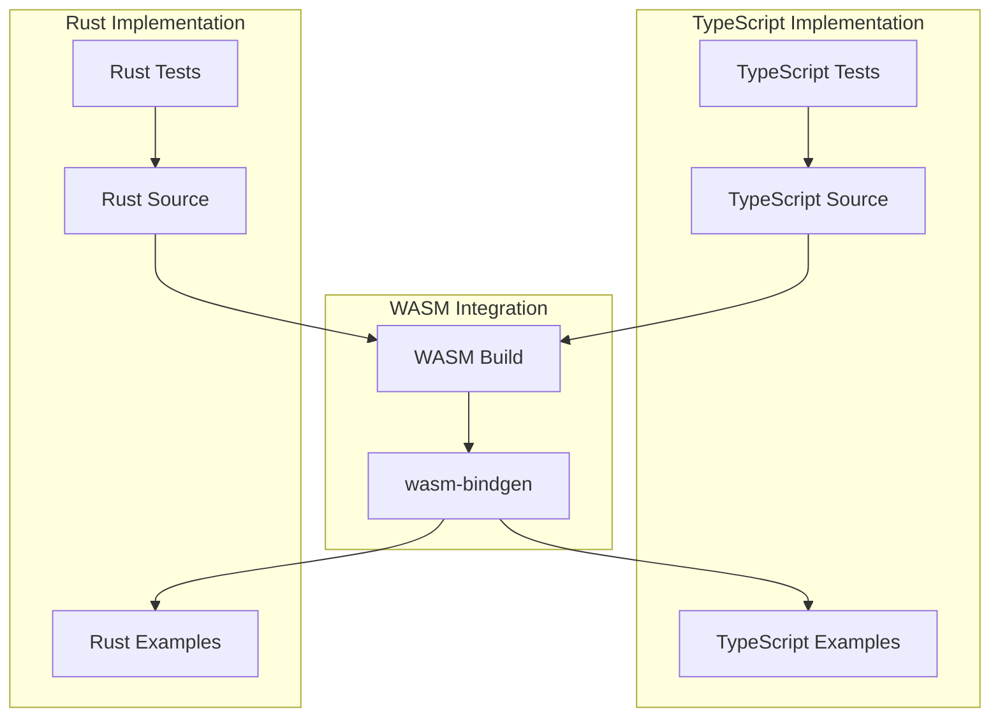

# AGENTS.md - Poker Hands Library Development Guide

This document provides comprehensive guidance for coding agents working on the poker-hands library project.

## Project Overview

The poker-hands library is a dual-implementation project featuring:

- **TypeScript/JavaScript implementation** for web applications
- **Rust/WASM implementation** for high-performance scenarios

The library provides functions for handling Texas Hold'em poker games, including hand evaluation, odds calculation, and card manipulation.

## Architecture



## Key Components

### 1. Card System

- **Location**: `src/model/card/Card.ts` (TypeScript) / `src/rust/src/card.rs` (Rust)
- **Purpose**: Defines card data structures and operations
- **Key Features**:
  - Suit enums: hearts, diamonds, clubs, spades
  - Value enums: 2-10, Jack, Queen, King, Ace
  - String parsing and formatting
  - Card validation and comparison

### 2. Hand Evaluation

- **Location**: `src/model/hand/` (TypeScript) / `src/rust/src/hand/` (Rust)
- **Purpose**: Detects and evaluates poker hands
- **Hand Types** (in order of rank):
  1. High Card
  2. Pair
  3. Two Pair
  4. Three of a Kind
  5. Straight
  6. Flush
  7. Full House
  8. Four of a Kind
  9. Straight Flush
  10. Royal Flush

### 3. Odds Calculation

- **Location**: `src/model/odds/` (TypeScript) / `src/rust/src/hand/` (Rust - TODO)
- **Purpose**: Calculates winning probabilities for hole cards
- **Features**: Monte Carlo simulation, percentage calculations

## Development Guidelines

### 1. Adding New Hand Types

#### TypeScript Implementation

1. Create detector function in `src/model/hand/detect/has[HandType].ts`
2. Create getter function in `src/model/hand/get/get[HandType].ts`
3. Update `src/model/hand/getBestHand.ts` to include the new hand type
4. Add tests in `__tests__/unit/model/hand/detector/` and `__tests__/unit/model/hand/get/`

#### Rust Implementation

1. Create detector function in `src/rust/src/hand/has_[hand_type].rs`
2. Create getter function in `src/rust/src/hand/get/get_[hand_type].rs`
3. Update `src/rust/src/hand/get_best_hand.rs` to include the new hand type
4. Add tests in `src/rust/src/tests/`

### 2. Testing Standards

#### TypeScript Tests

- Use Jest framework
- Test files location: `__tests__/unit/`
- Test naming: `describe("[functionality]", () => { ... })`
- Import helper functions from `src/model/card/cards.ts`

#### Rust Tests

- Use `#[test]` attribute
- Test files location: `src/rust/src/tests/`
- Test naming: `fn test_[functionality]() { ... }`
- Use `assert!()` and `assert_eq!()` macros

### 3. Code Style Guidelines

#### TypeScript

- Use TypeScript interfaces for type safety
- Follow ESLint configuration in `.eslintrc.js`
- Use descriptive function and variable names
- Implement proper error handling

#### Rust

- Use `wasm-bindgen` for WASM compatibility
- Follow Rust naming conventions (snake_case for functions, PascalCase for types)
- Implement proper error handling with `Result<T, E>`
- Use `#[wasm_bindgen]` attribute for exported functions

### 4. Performance Considerations

#### TypeScript Implementation

- Use efficient algorithms for hand evaluation
- Implement memoization for repeated calculations
- Optimize combinatorics operations

#### Rust Implementation

- Leverage Rust's ownership model for memory safety
- Use efficient data structures
- Profile with `cargo flamegraph` for optimization
- Ensure WASM compatibility for web deployment

## Build and Development Commands

### TypeScript Development

```bash
# Build TypeScript
npm run build

# Run TypeScript tests
npm run test

# Run development server
npm start
```

### Rust Development

```bash
# Run Rust tests
npm run test:rust

# Build WASM module
npm run build:wasm

# Run Node.js examples
npm run example:node
```

### Cross-Platform Testing

```bash
# Test both TypeScript and Rust implementations
npm run test && npm run test:rust

# Build and test WASM examples
npm run build:wasm && npm run example:node
```

## Data Structures

### TypeScript Card Interface

```typescript
interface Card {
  suit: Suit;
  value: Value;
}
```

### Rust Card Struct

```rust
#[wasm_bindgen]
pub struct Card {
    suit: Suit,
    value: Value,
}
```

### Hand Result Structure

```typescript
interface HandInterface {
  type: HandType;
  value: () => Value;
  subvalue: () => Value | null;
  cards: () => Card[];
  kickers: () => Card[];
}
```

## Common Patterns

### 1. Hand Detection Pattern

```typescript
// TypeScript
const hasFlush = (cards: Card[], presortedSuits: Suit[][]): boolean => {
  // Implementation
};

// Rust
#[wasm_bindgen]
impl Hand {
    pub fn has_flush(&self) -> bool {
        // Implementation
    }
}
```

### 2. Hand Retrieval Pattern

```typescript
// TypeScript
const getFlush = (cards: Card[]): HandInterface => {
  // Implementation
};

// Rust
#[wasm_bindgen]
impl Hand {
    pub fn get_flush(&self) -> HandResult {
        // Implementation
    }
}
```

### 3. Testing Pattern

```typescript
// TypeScript
describe("detect flushes", () => {
  test("detect a flush", () => {
    expect(hasFlush(cards("2d", "4d", "Qd", "Jd", "Td"))).toBe(true);
  });
});
```

```rust
// Rust
#[test]
fn test_has_flush() {
    let cards = vec![
        Card::new(Suit::Hearts, Value::Ace),
        // More cards...
    ];
    let hand = Hand::new(cards);
    assert!(hand.has_flush());
}
```

## Error Handling

### TypeScript

- Use Error objects for runtime errors
- Validate input parameters
- Provide meaningful error messages

### Rust

- Use `Result<T, E>` for error handling
- Implement custom error types
- Handle panics at WASM boundaries

## Performance Targets

### Hand Evaluation

- **TypeScript**: ≥10k evaluations/second
- **Rust/WASM**: ≥50k evaluations/second

### Memory Usage

- **TypeScript**: <5MB per 1000 hands
- **Rust/WASM**: <2MB per 1000 hands

### Cold Start Time

- **WASM**: <10ms initialization time

## Integration Points

### 1. WASM Module

- Build location: `src/rust/pkg/`
- JavaScript bindings: `poker_hands.js`
- TypeScript definitions: `poker_hands.d.ts`

### 2. Browser Integration

- Use `WebAssembly.instantiateStreaming()` for loading
- Handle module initialization asynchronously
- Provide fallback for unsupported browsers

### 3. Node.js Integration

- Use `fs` to load WASM module
- Provide synchronous and asynchronous APIs
- Handle module caching

## Debugging and Profiling

### TypeScript Debugging

- Use Chrome DevTools for performance analysis
- Implement console logging for debugging
- Use Jest coverage reports for test coverage

### Rust Debugging

- Use `cargo test` for unit tests
- Use `cargo bench` for benchmarks
- Use `cargo flamegraph` for performance profiling
- Use `wasm-profiler` for WASM-specific analysis

## Future Enhancements

### 1. Advanced Features

- Multi-player hand comparison
- Tournament simulation
- Hand history analysis
- Probability calculations

### 2. Performance Optimizations

- SIMD operations for batch processing
- Parallel processing for odds calculations
- Caching for repeated evaluations

### 3. Platform Support

- Native mobile applications
- Server-side deployment
- Cloud-based services

## Contributing Guidelines

### 1. Code Quality

- Follow existing code patterns
- Write comprehensive tests
- Update documentation
- Ensure cross-language compatibility

### 2. Testing Requirements

- 100% test coverage for new features
- Cross-validation between TypeScript and Rust implementations
- Performance regression testing

### 3. Documentation

- Update README.md for new features
- Add inline documentation for complex functions
- Provide usage examples

## Conclusion

This poker-hands library provides a robust foundation for poker game development with both TypeScript and Rust implementations. The dual-language approach ensures flexibility for different use cases while maintaining performance and accuracy.

When working on this project, always consider:

- Cross-language compatibility
- Performance optimization
- Comprehensive testing
- Clear documentation
- User-friendly APIs

For questions or clarification, refer to the existing codebase and test files to understand established patterns and conventions.
