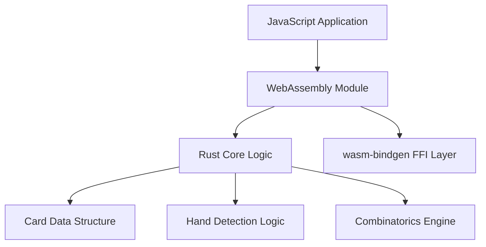

# Poker Hands Library: Current Status & Future Work

## Completed Implementation

### ✅ Core Rust Implementation

- **Data Structures**: `card.rs`, `hand.rs` with efficient bitflags for suits/values
- **Card Handling**: String parsing, validation, and conversion methods
- **Hand Detection**: All hand type detectors (flush, straight, pairs, etc.)
- **WASM Integration**: Configured `Cargo.toml` for WASM target with `wasm-bindgen`
- **Hand Getters**: Complete implementation of all hand getter functions with proper return types
- **Kickers**: `get_kickers.rs` implementation for proper hand evaluation

### ✅ Available Commands

- `npm run test:rust` - Run Rust tests
- `npm run example:node` - Build WASM and test Node.js examples
- `npm run build:wasm` - Build WASM module
- `npm run test` - Run TypeScript tests

## Current Architecture



## Future Work

### 🔄 Performance Optimization

- Profile critical paths with `cargo flamegraph`
- Apply SIMD operations to batch card evaluations where applicable
- Validate performance metrics:
  - Hand evaluation speed (≥50k evaluations/sec)
  - Memory usage (<2MB per 1000 hands)
  - Cold start time (<10ms)

### 🔄 Enhanced Testing Strategy

#### Performance Tests

- Mirror existing JS performance tests in Rust benchmarks
- Use `cargo flamegraph` for profiling
- Implement `wasm-profiler` for WASM-specific analysis

#### Test Coverage Requirements

- 100% coverage of all hand detection algorithms
- Memory safety tests for 10,000+ concurrent hand evaluations
- Cross-language data marshaling validation
- FFI boundary error handling tests

### 🔄 Documentation & Error Handling

- Complete Rust doc comments for all public APIs
- Implement comprehensive error handling with `Result` types
- Add panic handling strategy for WASM boundary safety
- Create API reference documentation

### 🔄 Odds Calculation Implementation

- Port odds calculation logic from TypeScript to Rust
- Implement percentage calculation functions
- Ensure performance parity with JavaScript implementation

## Implementation Notes

### Key Requirements

1. **Incremental Development**: Each step should be reviewable and testable independently
2. **Memory Safety**: Use Rust's ownership model for safe card comparisons
3. **Performance**: Maintain or improve upon JavaScript implementation performance
4. **Cross-Language Integration**: Ensure seamless data marshaling between JS and Rust

### Project Structure

```
src/
├── rust/                    # Rust/WASM implementation
│   ├── src/
│   │   ├── card.rs         # Card data structures
│   │   ├── hand.rs         # Hand detection logic
│   │   └── hand/           # Hand-specific modules
│   └── package.json        # Rust build scripts
├── model/                  # TypeScript implementation
└── examples/               # Usage examples
    ├── node-wasm/          # Node.js WASM examples
    └── browser-wasm/       # Browser WASM examples
```

### Testing Frameworks

- **Rust**: `wasm-bindgen-test`, `Criterion.rs` for benchmarks
- **JavaScript**: Jest for TypeScript tests
- **Integration**: Cross-language boundary validation
- **Performance**: Profiling and benchmarking tools

## Rust Hand Implementation Status

### Completed Hand Types

- [x] High Card
- [x] Pair
- [x] Two Pair
- [x] Three of a Kind
- [x] Straight
- [x] Flush
- [x] Full House
- [x] Four of a Kind
- [x] Straight Flush
- [x] Royal Flush

### Key Implementation Details

- All hand getters return structured data with hand type, cards, and kickers
- `get_best_hand.rs` properly integrates all hand detection algorithms
- Efficient bit-level operations for hand evaluation
- Memory-safe data structures for cross-language compatibility
