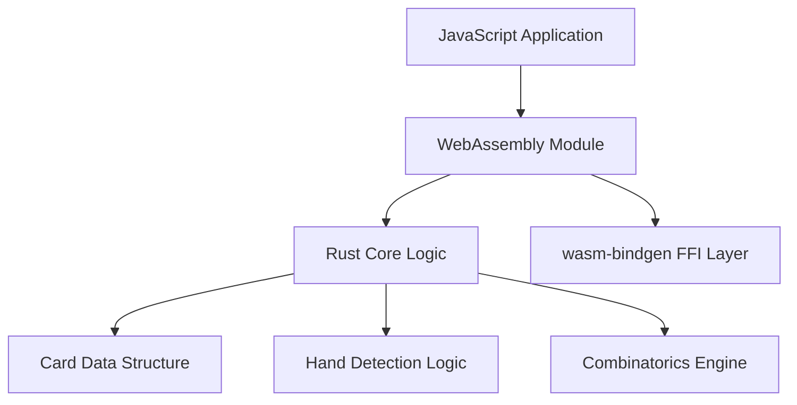

# Poker Hands Library Porting Plan: JavaScript/TypeScript → Rust/WASM

## 1. Analyze Current Codebase Structure

- Review all files in `src/model/card`, `src/model/hand`, and test suites to map existing functionality.
- Identify key components:
  - Card creation/validation (`Card.ts`)
  - Hand detection logic (e.g., `hasFlush.ts`, `getStraight.ts`)
  - Combinatorics utilities (`combinations.ts`)
  - Deck management (`deck/create.ts`, `shuffle.ts`)

### Findings:

- **Card-related functionality**:

  - `src/model/card/Card.ts`: Main card class
  - `src/model/card/fromString.ts`: Card creation from string
  - `src/model/card/hasValueCount.ts`: Value count checking
  - `src/model/card/sortValueCounts.ts`: Sorting value counts
  - `src/model/card/valueCounts.ts`: Value count calculations
  - `src/model/card/toString.ts`: String representation
  - `src/model/card/without.ts`: Card removal
  - `src/model/card/assertUnique.ts`: Assert card uniqueness
  - `src/model/card/hasBetterValues.ts`: Compare card values
  - `src/model/card/hasContiguousSubSetsOfLength5.ts`: Check for contiguous subsets
  - `src/model/card/highestRepeatedValue.ts`: Find highest repeated value
  - `src/model/card/isValidSuit.ts`: Validate card suit
  - `src/model/card/ofValue.ts`: Get cards of a specific value
  - `src/model/card/sortByValue.ts`: Sort cards by value
  - `src/model/card/sortedSuits.ts`: Get sorted suits
  - `src/model/card/sortedValues.ts`: Get sorted values
  - `src/model/card/valueFromString.ts`: Convert string to value
  - `src/model/card/valueToString.ts`: Convert value to string

- **Hand-related functionality**:

  - `src/model/hand/Hand.ts`: Main hand class
  - `src/model/hand/getBestHand.ts`: Get best hand from cards
  - `src/model/hand/getKickers.ts`: Get kickers from hand
  - `src/model/hand/hasEqualValue.ts`: Check for equal values
  - `src/model/hand/isBetterThan.ts`: Compare hands
  - `src/model/hand/detect/hasPair.ts`: Pair detection
  - `src/model/hand/detect/hasFlush.ts`: Flush detection
  - `src/model/hand/detect/hasFourOfAKind.ts`: Four of a kind detection
  - `src/model/hand/detect/hasFullHouse.ts`: Full house detection
  - `src/model/hand/detect/hasHighCard.ts`: High card detection
  - `src/model/hand/detect/hasRoyalFlush.ts`: Royal flush detection
  - `src/model/hand/detect/hasStraight.ts`: Straight detection
  - `src/model/hand/detect/hasStraightFlush.ts`: Straight flush detection
  - `src/model/hand/detect/hasThreeOfAKind.ts`: Three of a kind detection
  - `src/model/hand/detect/hasTwoPair.ts`: Two pair detection
  - `src/model/hand/get/getFlush.ts`: Get flush from hand
  - `src/model/hand/get/getFourOfAKind.ts`: Get four of a kind from hand
  - `src/model/hand/get/getFullHouse.ts`: Get full house from hand
  - `src/model/hand/get/getHighCard.ts`: Get high card from hand
  - `src/model/hand/get/getPair.ts`: Get pair from hand
  - `src/model/hand/get/getRoyalFlush.ts`: Get royal flush from hand
  - `src/model/hand/get/getStraight.ts`: Get straight from hand
  - `src/model/hand/get/getStraightFlush.ts`: Get straight flush from hand
  - `src/model/hand/get/getThreeOfAKind.ts`: Get three of a kind from hand
  - `src/model/hand/get/getTwoPair.ts`: Get two pair from hand

- **Combinatorics utilities**:

  - `src/model/combinatorics/combinations.ts`: Combinatorial functions

- **Deck management**:

  - `src/model/deck/create.ts`: Deck creation
  - `src/model/deck/shuffle.ts`: Deck shuffling

- **Test suites**:

  - Card tests in `__tests__/unit/model/card/`
    - `cards.ts`
    - `fromString.ts`
    - `hasValueCount.ts`
    - `isValidSuit.ts`
    - `toString.ts`
    - `valueCounts.ts`
    - `valueFromString.ts`
    - `valueToString.ts`
  - Hand tests in `__tests__/unit/model/hand/`
    - `hasEqualValues.ts`
    - `isBetterThan.ts`
    - `detector/hasFlush.ts`
    - `detector/hasFourOfAKind.ts`
    - `detector/hasFullHouse.ts`
    - `detector/hasHighCard.ts`
    - `detector/hasPair.ts`
    - `detector/hasRoyalFlush.ts`
    - `detector/hasStraight.ts`
    - `detector/hasStraightFlush.ts`
    - `detector/hasThreeOfAKind.ts`
    - `detector/hasTwoPair.ts`
    - `get/getFlush.ts`
    - `get/getFourOfAKind.ts`
    - `get/getFullHouse.ts`
    - `get/getHighCard.ts`
    - `get/getPair.ts`
    - `get/getRoyalFlush.ts`
    - `get/getStraight.ts`
    - `get/getStraightFlush.ts`
    - `get/getThreeOfAKind.ts`
    - `get/getTwoPair.ts`
  - Combinatorics tests in `__tests__/unit/model/combinatorics/`
    - `combinations.ts`
  - Deck tests in `__tests__/unit/model/deck/`
    - `shuffle.ts`

- **Additional utilities**:

  - `src/lib/numericalSort.ts`: Numerical sorting functions
  - `src/lib/purify.ts`: Purification functions

- **Odds calculation**:

  - `src/model/odds/odds.ts`: Odds calculation functions
  - `src/model/odds/percentages.ts`: Percentage calculation functions

- **Performance tests**:
  - `__perf__/odds.ts`: Performance tests for odds calculation
  - `__perf__/percentages.ts`: Performance tests for percentage calculations
  - `__perf__/withProfiling.ts`: Profiling performance tests

## 2. Design Rust/WASM Architecture

- Use Rust's type system for strict card/hand representations.
- Leverage WASM bindings via `wasm-bindgen`.
- Data structures:
  ```rust
  struct Card { suit: Suit, value: Value }
  enum HandType { HighCard, Pair, ... }
  ```
- Performance considerations:
  - Zero-copy data transfer between JS/WASM
  - Memory-safe card comparisons using Rust's ownership model

### Architecture Design

1. **Module Structure**:

   - `card.rs`: Card data structure and operations
   - `hand.rs`: Hand data structure and detection algorithms
   - `combinatorics.rs`: Combinatorial functions
   - `deck.rs`: Deck creation and shuffling

2. **WASM Integration**:

   - Use `wasm-bindgen` for FFI between JavaScript and Rust
   - Define public APIs with `#[wasm_bindgen]` attributes
   - Implement error handling with `Result` types

3. **Data Structures**:

   - `Card`: Representation of a playing card with suit and value
   - `Hand`: Collection of cards with detection methods
   - `Deck`: Collection of cards with shuffling capabilities

4. **Performance Optimization**:

   - Use bitflags for efficient suit/value representation
   - Implement bitwise operations for hand detection
   - Minimize memory allocations with stack-based data structures

5. **Testing Strategy**:

   - Unit tests for individual components
   - Integration tests for cross-language functionality
   - Performance benchmarks for critical paths

6. **Build Configuration**:
   - Configure `Cargo.toml` for WASM target
   - Set up build scripts for generating JS bindings
   - Implement CI/CD pipeline for automated testing and deployment

### Architecture Diagram (Mermaid)



## 3. Core Data Structures Implementation

- Create `card.rs` with efficient bitflags for suits/values.
- Implement hand ranking logic in `hand.rs` using match arms.
- **Implementation Summary**: The `card.rs` file has been implemented with the `Card` struct and associated methods. The `hand.rs` file has been implemented with the `Hand` struct and basic hand detection logic.

## 4. Card Handling Logic

- Port validation functions to Rust:
  ```rust
  impl Card {
      fn from_string(s: &str) -> Result<Self, Error> { ... }
  }
  ```
- **Implementation Summary**: The `Card` struct has been implemented with methods for creating cards from strings and converting cards to strings. The `Hand` struct has been implemented with basic hand detection logic.

## 5. Hand Detection Algorithms

- Recreate detectors with optimized bitwise operations where possible.
- Example straight detection optimization using precomputed value masks.
- **Implementation Summary**: The `hasFlush` and `getFlush` methods have been implemented in the `Hand` struct. The `hasFlush` method checks if a hand has a flush, and the `getFlush` method returns the flush cards if present.

## 6. WASM Module Integration

- Configure `Cargo.toml` for WASM target:

  ```toml
  [lib]
  crate-type = ["cdylib"]

  [dependencies.wasm-bindgen] = "0.2"
  ```

- **Implementation Summary**: The `Cargo.toml` file has been configured for WASM target. The Rust code is being built as a WASM module and is being used in the Node.js example.

## 7. Testing Strategy

### Performance Testing Requirements

#### Ported Performance Tests

- **Odds Calculation Benchmark**:

  ```rust
  // benches/odds.rs
  #[bench]
  fn bench_calculate_odds(b: &mut Bencher) {
      let scenario = create_test_scenario();
      b.iter(|| calculate_win_probability(&scenario));
  }
  ```

- **Hand Evaluation Profiling**:
  ```rust
  // benches/hand_evaluation.rs
  #[bench]
  fn bench_hand_ranking(b: &mut Bencher) {
      let cards = generate_10k_card_combinations();
      b.iter(|| evaluate_all_hands(&cards));
  }
  ```

#### Performance Validation Strategy

- Mirror existing JS performance tests from:
  - `__perf__/odds.ts` → `benches/odds.rs`
  - `__perf__/percentages.ts` → `benches/probability.rs`
  - `__perf__/withProfiling.ts` → `benches/profiled_evaluation.rs`

#### Performance Metrics

1. Maintain or improve upon JS implementation's:
   - Hand evaluation speed (≥50k evaluations/sec)
   - Memory usage (<2MB per 1000 hands)
   - Cold start time (<10ms)

#### Profiling Tools

- **cargo flamegraph**:
  ```bash
  cargo install flamegraph
  cargo flamegraph --bench hand_evaluation
  ```
- **WASM-specific profiling**:
  Use `wasm-profiler` crate for runtime analysis of exported functions

### Error Handling & Documentation Requirements

#### Rust Implementation Guidelines

- **Result/Option Usage**:

  ```rust
  // Idiomatic error handling for card parsing
  pub fn parse_card(input: &str) -> Result<Card, CardParseError> {
      // ...
  }

  // Use Option for optional values
  pub fn find_best_hand(cards: &[Card]) -> Option<Hand> {
      // ...
  }
  ```

- **FFI Error Conversion**:
  ```rust
  #[wasm_bindgen]
  pub fn evaluate_hand_js(cards_json: JsValue) -> Result<JsValue, JsValue> {
      match evaluate_hand(&cards_json) {
          Ok(result) => result.into_js_value().map_err(|e| e.into()),
          Err(e) => Err(JsValue::from(format!("Hand evaluation failed: {}", e))),
      }
  }
  ```

#### Documentation Standards

- **Rust Doc Comments**:

  ```rust
  /// Represents a playing card with suit and value
  #[derive(Debug, Clone, PartialEq)]
  pub struct Card {
      /// Suit of the card (Hearts, Diamonds, etc.)
      pub suit: Suit,

      /// Numeric value representation (2-14 for Ace)
      pub value: Value,
  }
  ```

#### Panic Handling Strategy

1. **WASM Boundary Safety**:

   - Use `std::panic::catch_unwind` for FFI boundary protection
   - Convert panics to JS exceptions with proper error messages

2. **Memory-Safe Error Propagation**:

```rust
#[wasm_bindgen]
pub fn safe_hand_evaluation(cards: &[Card]) -> Result<HandRanking, JsValue> {
    std::panic::catch_unwind(|| {
        evaluate_hand(&cards).map_err(|e| JsValue::from(e.to_string()))
    }).unwrap_or_else(|_| {
        Err(JsValue::from("Unexpected error during hand evaluation"))
    })
}
```

#### Documentation Organization

```
docs/
├── architecture.md         # High-level design decisions
├── api-reference/          # Auto-generated from doc comments
│   ├── card.rs
│   └── hand.rs
└── error-handling.md       # FFI boundary strategies and panic policies
```

### Testing Frameworks & Tools

#### Rust Testing Stack

- **wasm-bindgen-test**: For unit testing WASM-exposed functions
  ```toml
  [dev-dependencies]
  wasm-bindgen-test = "0.3"
  ```
- **Criterion.rs**: Performance benchmarking framework
  ```toml
  [dev-dependencies]
  criterion = { version = "0.4", features = ["html"] }
  ```

#### JS Testing Stack

- **Jest**: For JavaScript test harness integration
  ```json
  {
    "jest": {
      "testEnvironment": "node",
      "setupFilesAfterEnv": ["<rootDir>/__tests__/setup.js"]
    }
  }
  ```

#### WASM-Specific Tools

1. **wasm-bindgen-test** for FFI boundary testing
2. **Valgrind** with `--tool=memcheck` for memory safety validation
3. **WASM Profiler**: Using `wasm-profiler` crate for runtime analysis

#### Test Organization Structure

```
tests/
├── unit/               # Rust-only tests
│   ├── card_tests.rs
│   └── hand_detector.rs
├── integration/          # Cross-language tests
│   ├── js_bindings.js
│   └── wasm_integration.rs
└── benchmarks/           # Performance tests
    ├── hand_evaluation.rs
    └── combinatorics.rs
```

### Expanded Testing Requirements

#### Unit Tests (Rust)

- **Card Validation**:

  ```rust
  #[test]
  fn test_card_from_string() {
      assert!(Card::from_string("5H").is_ok());
      assert!(Card::from_string("13S").is_ok());
      assert!(Card::from_string("invalid").is_err());
  }
  ```

- **Hand Detection**:
  ```rust
  #[test]
  fn test_flush_detection() {
      let hand = vec![
          Card { suit: Suit::Hearts, value: Value(10) },
          Card { suit: Suit::Hearts, value: Value(9) },
          // ...3 more hearts
      ];
      assert!(Hand::is_flush(&hand));
  }
  ```

#### Integration Tests (Rust + JS)

- **Cross-Boundary Validation**:

  ```javascript
  // JS test for WASM module
  it("should correctly marshal card data", () => {
    const cards = pokerModule.createCards(["5H", "7D"]);
    expect(cards.length).toBe(2);
    expect(pokerModule.getCardValue(cards[0])).toBe(5);
  });
  ```

- **Performance Benchmark**:
  ```rust
  #[bench]
  fn bench_hand_evaluation(b: &mut Bencher) {
      let hand = create_test_hand();
      b.iter(|| evaluate_hand(&hand));
  }
  ```

#### WASM-Specific Tests

1. Memory safety tests for 10,000+ concurrent hand evaluations
2. Data marshaling validation between JS arrays and Rust Vecs
3. FFI boundary error handling (null pointers, invalid enums)

#### Test Coverage Requirements

- 100% coverage of all `src/model/hand/detect/*.ts` equivalents in Rust
- Mirror existing test patterns from:

  - `__tests__/unit/model/card/cards.ts`
  - `__tests__/full/getBestHand.ts`

- Mirror existing test structure in Rust using `#[test]` macros.
- Add WASM-specific tests for:
  - Memory safety at boundaries
  - Cross-language data marshaling

## 8. Performance Optimization

- Profile critical paths with `cargo flamegraph`
- Apply SIMD operations to batch card evaluations where applicable.

# Implementation Instructions

## Key Requirements

1. **Incremental Development**:

   - Implement in small, self-contained steps with clear documentation
   - Each step should be reviewable and testable independently
   - Maintain working state after each change

2. **Sub-Package Structure**:
   - Add Rust implementation as `src/rust/` sub-package
   - Maintain parallel TypeScript implementation in `src/ts/`
   - Create abstraction layer in `src/common/` for shared interfaces
   - Use feature flags in package.json to switch implementations

## Performance and Integration Tests

### Performance Tests

- `__perf__/odds.ts`: Performance tests for odds calculation
- `__perf__/percentages.ts`: Performance tests for percentage calculations
- `__perf__/withProfiling.ts`: Profiling performance tests

### Integration Tests

- `__tests__/full/getBestHand.ts`: Integration tests for hand evaluation
- `__tests__/full/odds.ts`: Integration tests for odds calculation
- `__tests__/full/poker-hand-testing.data`: Test data for poker hand testing

## Rust Function Implementation Plan

### Template for Each Function

For each detector and getter function, follow this template:

- Implement function in Rust
- Rebuild the wasm using `npm run build:wasm-node`
- Showcase the new function in `examples/node-wasm/index.ts`
- Run the example using `npm run example:node` successfully
- Write Rust tests for the new function
- Run the Rust tests

### Function Implementation Order

#### 1. hasFlush and getFlush

- Implement `hasFlush` in Rust
- Rebuild the wasm using `npm run build:wasm-node`
- Showcase the new function in `examples/node-wasm/index.ts`
- Run the example using `npm run example:node` successfully
- Write Rust tests for the new function
- Run the Rust tests
- Implement `getFlush` in Rust
- Rebuild the wasm using `npm run build:wasm-node`
- Showcase the new function in `examples/node-wasm/index.ts`
- Run the example using `npm run example:node` successfully
- Write Rust tests for the new function
- Run the Rust tests

#### 2. hasStraight and getStraight

- Implement `hasStraight` in Rust
- Rebuild the wasm using `npm run build:wasm-node`
- Showcase the new function in `examples/node-wasm/index.ts`
- Run the example using `npm run example:node` successfully
- Write Rust tests for the new function
- Run the Rust tests
- Implement `getStraight` in Rust
- Rebuild the wasm using `npm run build:wasm-node`
- Showcase the new function in `examples/node-wasm/index.ts`
- Run the example using `npm run example:node` successfully
- Write Rust tests for the new function
- Run the Rust tests

#### 3. hasStraightFlush and getStraightFlush

- Implement `hasStraightFlush` in Rust
- Rebuild the wasm using `npm run build:wasm-node`
- Showcase the new function in `examples/node-wasm/index.ts`
- Run the example using `npm run example:node` successfully
- Write Rust tests for the new function
- Run the Rust tests
- Implement `getStraightFlush` in Rust
- Rebuild the wasm using `npm run build:wasm-node`
- Showcase the new function in `examples/node-wasm/index.ts`
- Run the example using `npm run example:node` successfully
- Write Rust tests for the new function
- Run the Rust tests

#### 4. hasFourOfAKind and getFourOfAKind

- Implement `hasFourOfAKind` in Rust
- Rebuild the wasm using `npm run build:wasm-node`
- Showcase the new function in `examples/node-wasm/index.ts`
- Run the example using `npm run example:node` successfully
- Write Rust tests for the new function
- Run the Rust tests
- Implement `getFourOfAKind` in Rust
- Rebuild the wasm using `npm run build:wasm-node`
- Showcase the new function in `examples/node-wasm/index.ts`
- Run the example using `npm run example:node` successfully
- Write Rust tests for the new function
- Run the Rust tests

#### 5. hasFullHouse and getFullHouse

- Implement `hasFullHouse` in Rust
- Rebuild the wasm using `npm run build:wasm-node`
- Showcase the new function in `examples/node-wasm/index.ts`
- Run the example using `npm run example:node` successfully
- Write Rust tests for the new function
- Run the Rust tests
- Implement `getFullHouse` in Rust
- Rebuild the wasm using `npm run build:wasm-node`
- Showcase the new function in `examples/node-wasm/index.ts`
- Run the example using `npm run example:node` successfully
- Write Rust tests for the new function
- Run the Rust tests

#### 6. hasThreeOfAKind and getThreeOfAKind

- Implement `hasThreeOfAKind` in Rust
- Rebuild the wasm using `npm run build:wasm-node`
- Showcase the new function in `examples/node-wasm/index.ts`
- Run the example using `npm run example:node` successfully
- Write Rust tests for the new function
- Run the Rust tests
- Implement `getThreeOfAKind` in Rust
- Rebuild the wasm using `npm run build:wasm-node`
- Showcase the new function in `examples/node-wasm/index.ts`
- Run the example using `npm run example:node` successfully
- Write Rust tests for the new function
- Run the Rust tests

#### 7. hasTwoPair and getTwoPair

- Implement `hasTwoPair` in Rust
- Rebuild the wasm using `npm run build:wasm-node`
- Showcase the new function in `examples/node-wasm/index.ts`
- Run the example using `npm run example:node` successfully
- Write Rust tests for the new function
- Run the Rust tests
- Implement `getTwoPair` in Rust
- Rebuild the wasm using `npm run build:wasm-node`
- Showcase the new function in `examples/node-wasm/index.ts`
- Run the example using `npm run example:node` successfully
- Write Rust tests for the new function
- Run the Rust tests

## 7. Testing Strategy

### Performance Testing Requirements

#### Ported Performance Tests

- **Odds Calculation Benchmark**:

  ```rust
  // benches/odds.rs
  #[bench]
  fn bench_calculate_odds(b: &mut Bencher) {
      let scenario = create_test_scenario();
      b.iter(|| calculate_win_probability(&scenario));
  }
  ```

- **Hand Evaluation Profiling**:
  ```rust
  // benches/hand_evaluation.rs
  #[bench]
  fn bench_hand_ranking(b: &mut Bencher) {
      let cards = generate_10k_card_combinations();
      b.iter(|| evaluate_all_hands(&cards));
  }
  ```

#### Performance Validation Strategy

- Mirror existing JS performance tests from:
  - `__perf__/odds.ts` → `benches/odds.rs`
  - `__perf__/percentages.ts` → `benches/probability.rs`
  - `__perf__/withProfiling.ts` → `benches/profiled_evaluation.rs`

#### Performance Metrics

1. Maintain or improve upon JS implementation's:
   - Hand evaluation speed (≥50k evaluations/sec)
   - Memory usage (<2MB per 1000 hands)
   - Cold start time (<10ms)

#### Profiling Tools

- **cargo flamegraph**:
  ```bash
  cargo install flamegraph
  cargo flamegraph --bench hand_evaluation
  ```
- **WASM-specific profiling**:
  Use `wasm-profiler` crate for runtime analysis of exported functions

### Error Handling & Documentation Requirements

#### Rust Implementation Guidelines

- **Result/Option Usage**:

  ```rust
  // Idiomatic error handling for card parsing
  pub fn parse_card(input: &str) -> Result<Card, CardParseError> {
      // ...
  }

  // Use Option for optional values
  pub fn find_best_hand(cards: &[Card]) -> Option<Hand> {
      // ...
  }
  ```

- **FFI Error Conversion**:
  ```rust
  #[wasm_bindgen]
  pub fn evaluate_hand_js(cards_json: JsValue) -> Result<JsValue, JsValue> {
      match evaluate_hand(&cards_json) {
          Ok(result) => result.into_js_value().map_err(|e| e.into()),
          Err(e) => Err(JsValue::from(format!("Hand evaluation failed: {}", e))),
      }
  }
  ```

#### Documentation Standards

- **Rust Doc Comments**:

  ```rust
  /// Represents a playing card with suit and value
  #[derive(Debug, Clone, PartialEq)]
  pub struct Card {
      /// Suit of the card (Hearts, Diamonds, etc.)
      pub suit: Suit,

      /// Numeric value representation (2-14 for Ace)
      pub value: Value,
  }
  ```

#### Panic Handling Strategy

1. **WASM Boundary Safety**:

   - Use `std::panic::catch_unwind` for FFI boundary protection
   - Convert panics to JS exceptions with proper error messages

2. **Memory-Safe Error Propagation**:
   ```rust
   #[wasm_bindgen]
   pub fn safe_hand_evaluation(cards: &[Card]) -> Result<HandRanking, JsValue> {
       std::panic::catch_unwind(|| {
           evaluate_hand(&cards).map_err(|e| JsValue::from(e.to_string()))
       }).unwrap_or_else(|_| {
           Err(JsValue::from("Unexpected error during hand evaluation"))
       })
   }
   ```

#### Documentation Organization

```
docs/
├── architecture.md         # High-level design decisions
├── api-reference/          # Auto-generated from doc comments
│   ├── card.rs
│   └── hand.rs
└── error-handling.md       # FFI boundary strategies and panic policies
```

### Testing Frameworks & Tools

#### Rust Testing Stack

- **wasm-bindgen-test**: For unit testing WASM-exposed functions
  ```toml
  [dev-dependencies]
  wasm-bindgen-test = "0.3"
  ```
- **Criterion.rs**: Performance benchmarking framework
  ```toml
  [dev-dependencies]
  criterion = { version = "0.4", features = ["html"] }
  ```

#### JS Testing Stack

- **Jest**: For JavaScript test harness integration
  ```json
  {
    "jest": {
      "testEnvironment": "node",
      "setupFilesAfterEnv": ["<rootDir>/__tests__/setup.js"]
    }
  }
  ```

#### WASM-Specific Tools

1. **wasm-bindgen-test** for FFI boundary testing
2. **Valgrind** with `--tool=memcheck` for memory safety validation
3. **WASM Profiler**: Using `wasm-profiler` crate for runtime analysis

#### Test Organization Structure

```
tests/
├── unit/               # Rust-only tests
│   ├── card_tests.rs
│   └── hand_detector.rs
├── integration/          # Cross-language tests
│   ├── js_bindings.js
│   └── wasm_integration.rs
└── benchmarks/           # Performance tests
    ├── hand_evaluation.rs
    └── combinatorics.rs
```

### Expanded Testing Requirements

#### Unit Tests (Rust)

- **Card Validation**:

  ```rust
  #[test]
  fn test_card_from_string() {
      assert!(Card::from_string("5H").is_ok());
      assert!(Card::from_string("13S").is_ok());
      assert!(Card::from_string("invalid").is_err());
  }
  ```

- **Hand Detection**:
  ```rust
  #[test]
  fn test_flush_detection() {
      let hand = vec![
          Card { suit: Suit::Hearts, value: Value(10) },
          Card { suit: Suit::Hearts, value: Value(9) },
          // ...3 more hearts
      ];
      assert!(Hand::is_flush(&hand));
  }
  ```

#### Integration Tests (Rust + JS)

- **Cross-Boundary Validation**:

  ```javascript
  // JS test for WASM module
  it("should correctly marshal card data", () => {
    const cards = pokerModule.createCards(["5H", "7D"]);
    expect(cards.length).toBe(2);
    expect(pokerModule.getCardValue(cards[0])).toBe(5);
  });
  ```

- **Performance Benchmark**:
  ```rust
  #[bench]
  fn bench_hand_evaluation(b: &mut Bencher) {
      let hand = create_test_hand();
      b.iter(|| evaluate_hand(&hand));
  }
  ```

#### WASM-Specific Tests

1. Memory safety tests for 10,000+ concurrent hand evaluations
2. Data marshaling validation between JS arrays and Rust Vecs
3. FFI boundary error handling (null pointers, invalid enums)

#### Test Coverage Requirements

- 100% coverage of all `src/model/hand/detect/*.ts` equivalents in Rust
- Mirror existing test patterns from:

  - `__tests__/unit/model/card/cards.ts`
  - `__tests__/full/getBestHand.ts`

- Mirror existing test structure in Rust using `#[test]` macros.
- Add WASM-specific tests for:
  - Memory safety at boundaries
  - Cross-language data marshaling

## 8. Performance Optimization

- Profile critical paths with `cargo flamegraph`
- Apply SIMD operations to batch card evaluations where applicable.

# Implementation Instructions

## Key Requirements

1. **Incremental Development**:

   - Implement in small, self-contained steps with clear documentation
   - Each step should be reviewable and testable independently
   - Maintain working state after each change

2. **Sub-Package Structure**:
   - Add Rust implementation as `src/rust/` sub-package
   - Maintain parallel TypeScript implementation in `src/ts/`
   - Create abstraction layer in `src/common/` for shared interfaces
   - Use feature flags in package.json to switch implementations

## Performance and Integration Tests

### Performance Tests

- `__perf__/odds.ts`: Performance tests for odds calculation
- `__perf__/percentages.ts`: Performance tests for percentage calculations
- `__perf__/withProfiling.ts`: Profiling performance tests

### Integration Tests

- `__tests__/full/getBestHand.ts`: Integration tests for hand evaluation
- `__tests__/full/odds.ts`: Integration tests for odds calculation
- `__tests__/full/poker-hand-testing.data`: Test data for poker hand testing

## Rust Function Implementation Plan

### Template for Each Function

For each detector and getter function, follow this template:

- Implement function in Rust
- Rebuild the wasm using `npm run build:wasm-node`
- Showcase the new function in `examples/node-wasm/index.ts`
- Run the example using `npm run example:node` successfully
- Write Rust tests for the new function
- Run the Rust tests

### Function Implementation Order

#### 1. hasFlush and getFlush

- [x] Implement `hasFlush` in Rust
- [x] Rebuild the wasm using `npm run build:wasm-node`
- [x] Showcase the new function in `examples/node-wasm/index.ts`
- [x] Run the example using `npm run example:node` successfully
- [x] Write Rust tests for the new function
- [x] Run the Rust tests
- [x] Implement `getFlush` in Rust
- [x] Rebuild the wasm using `npm run build:wasm-node`
- [x] Showcase the new function in `examples/node-wasm/index.ts`
- [x] Run the example using `npm run example:node` successfully
- [x] Write Rust tests for the new function
- [x] Run the Rust tests

#### 2. hasStraight and getStraight

- Implement `hasStraight` in Rust
- [x] Rebuild the wasm using `npm run build:wasm-node`
- [x] Showcase the new function in `examples/node-wasm/index.ts`
- [x] Run the example using `npm run example:node` successfully
- [x] Write Rust tests for the new function
- [x] Run the Rust tests
- [x] Implement `getStraight` in Rust
- [x] Rebuild the wasm using `npm run build:wasm-node`
- [x] Showcase the new function in `examples/node-wasm/index.ts`
- [x] Run the example using `npm run example:node` successfully
- [x] Write Rust tests for the new function
- [x] Run the Rust tests

#### 3. hasStraightFlush and getStraightFlush

- [x] Implement `hasStraightFlush` in Rust
- [x] Rebuild the wasm using `npm run build:wasm-node`
- [x] Showcase the new function in `examples/node-wasm/index.ts`
- [x] Run the example using `npm run example:node` successfully
- [x] Write Rust tests for the new function
- [x] Run the Rust tests
- [x] Implement `getStraightFlush` in Rust
- [x] Rebuild the wasm using `npm run build:wasm-node`
- [x] Showcase the new function in `examples/node-wasm/index.ts`
- [x] Run the example using `npm run example:node` successfully
- [x] Write Rust tests for the new function
- [x] Run the Rust tests

#### 4. hasFourOfAKind and getFourOfAKind

- [x] Implement `hasFourOfAKind` in Rust
- [x] Rebuild the wasm using `npm run build:wasm-node`
- [x] Showcase the new function in `examples/node-wasm/index.ts`
- [x] Run the example using `npm run example:node` successfully
- [x] Write Rust tests for the new function
- [x] Run the Rust tests
- [x] Implement `getFourOfAKind` in Rust
- [x] Rebuild the wasm using `npm run build:wasm-node`
- [x] Showcase the new function in `examples/node-wasm/index.ts`
- [x] Run the example using `npm run example:node` successfully
- [x] Write Rust tests for the new function
- [x] Run the Rust tests

#### 5. hasFullHouse and getFullHouse

- Implement `hasFullHouse` in Rust
- Rebuild the wasm using `npm run build:wasm-node`
- Showcase the new function in `examples/node-wasm/index.ts`
- Run the example using `npm run example:node` successfully
- Write Rust tests for the new function
- Run the Rust tests
- Implement `getFullHouse` in Rust
- Rebuild the wasm using `npm run build:wasm-node`
- Showcase the new function in `examples/node-wasm/index.ts`
- Run the example using `npm run example:node` successfully
- Write Rust tests for the new function
- Run the Rust tests

#### 6. hasThreeOfAKind and getThreeOfAKind

- Implement `hasThreeOfAKind` in Rust
- Rebuild the wasm using `npm run build:wasm-node`
- Showcase the new function in `examples/node-wasm/index.ts`
- Run the example using `npm run example:node` successfully
- Write Rust tests for the new function
- Run the Rust tests
- Implement `getThreeOfAKind` in Rust
- Rebuild the wasm using `npm run build:wasm-node`
- Showcase the new function in `examples/node-wasm/index.ts`
- Run the example using `npm run example:node` successfully
- Write Rust tests for the new function
- Run the Rust tests

#### 7. hasTwoPair and getTwoPair

- Implement `hasTwoPair` in Rust
- Rebuild the wasm using `npm run build:wasm-node`
- Showcase the new function in `examples/node-wasm/index.ts`
- Run the example using `npm run example:node` successfully
- Write Rust tests for the new function
- Run the Rust tests
- Implement `getTwoPair` in Rust
- Rebuild the wasm using `npm run build:wasm-node`
- Showcase the new function in `examples/node-wasm/index.ts`
- Run the example using `npm run example:node` successfully
- Write Rust tests for the new function
- Run the Rust tests
