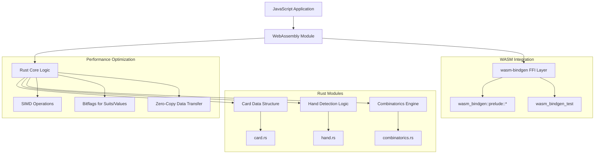

# Architecture Diagram for Poker Hands Library in Rust/WASM

```mermaid
graph TD
    JS[JavaScript Application] --> WASM[WebAssembly Module]
    WASM --> RUST[Rust Core Logic]
    RUST --> CARD["Card Data Structure"]
    RUST --> HAND["Hand Detection Logic"]
    RUST --> COMBO["Combinatorics Engine"]
    WASM --> BINDINGS["wasm-bindgen FFI Layer"]

    subgraph Rust Modules
        CARD --> card.rs
        HAND --> hand.rs
        COMBO --> combinatorics.rs
    end

    subgraph WASM Integration
        BINDINGS --> wasm_bindgen::prelude::*
        BINDINGS --> wasm_bindgen_test
    end

    subgraph Performance Optimization
        RUST --> SIMD[SIMD Operations]
        RUST --> BITFLAGS[Bitflags for Suits/Values]
        RUST --> ZEROCOPY[Zero-Copy Data Transfer]
    end
```
